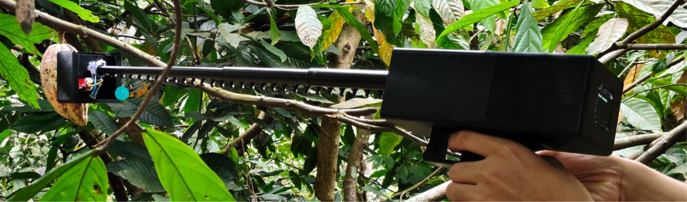
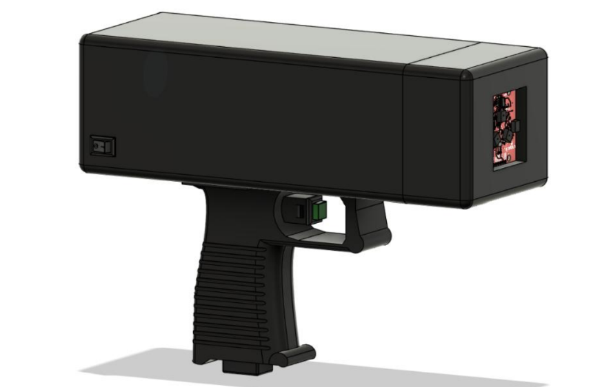
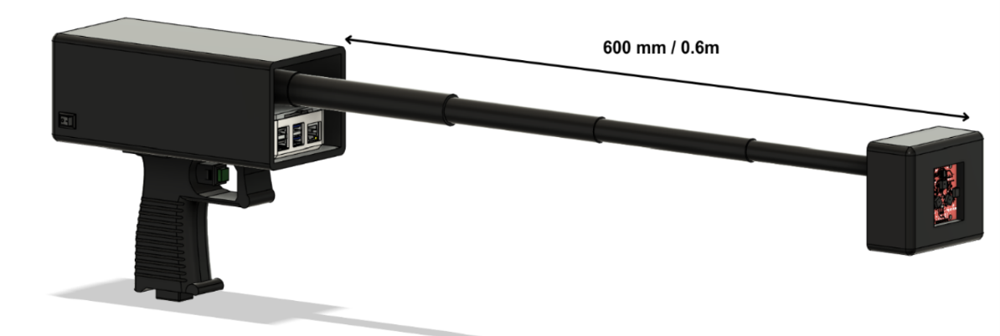

# 🍫 Portable NIR Spectroscopy System for Early Black Pod Rot Detection

SpectraCao is a portable, non-invasive NIR spectroscopy system that uses an AS7265X multispectral sensor, Raspberry Pi 4 Model B, and Partial Least Squares Discriminant Analysis (PLS-DA) to detect spectral changes associated with early-stage Black Pod Rot in cacao pods.

The system captures spectral data from cacao pods, preprocesses the signals to reduce noise and variation, and classifies pod health based on learned spectral patterns. It was designed for repeated field monitoring without physically damaging the pods.



---

## 🛠️ Technologies Used

### Hardware
- Raspberry Pi 4 Model B – main processing unit
- AS7265X Multispectral Sensor – spectral data acquisition
- OLED Display – real-time classification output
- Li-Po Battery – portable power source
- XL4015 Buck Converter – voltage regulation
- Incandescent Rice Bulbs – NIR illumination
- Push Button – initializes spectral readings
- I2C – sensor communication

The AS7265X provides discrete spectral measurements, while the Raspberry Pi handles acquisition, preprocessing, and classification.

### Software & Data Science
- Python
- NumPy
- Pandas
- SciPy
- Scikit-learn
- Jupyter Notebook
- Savitzky-Golay Filtering
- Standard Normal Variate (SNV)
- Unit Normal Variate (UNV)
- Partial Least Squares Discriminant Analysis (PLS-DA)
- K-Fold Cross-Validation
- ROC-AUC Analysis

---

<table>
  <tr>
    <td align="center" width="50%">
      <br>
      <b>Portable</b>
    </td>
    <td align="center" width="50%">
      <br>
      <b>Extendable</b>
    </td>
  </tr>
</table>

## ✨ Features

### 📡 NIR Spectral Sensing
Captures reflected spectral information from cacao pod surfaces.

### 🧹 Spectral Preprocessing
- Savitzky-Golay filtering reduces high-frequency noise.
- SNV and UNV reduce scatter and intensity variations.

### 🤖 PLS-DA Classification
Classifies cacao pods according to learned spectral patterns.

### 📊 Model Validation
Uses K-Fold Cross-Validation and ROC-AUC analysis to evaluate model performance.

### 🌱 Non-Invasive Monitoring
Allows the same cacao pods to be repeatedly monitored without destructive sampling.

### 📱 Portable Field Device
Raspberry Pi-based architecture allows processing directly on the device.

### 📏 Extendable Measurement Arm
Features an extendable arm reaching up to 600 mm, allowing flexible and non-contact spectral measurements of cacao pods.

### 🖥️ Real-Time Output
Displays pod health classification through an OLED screen.

The software pipeline runs on the Raspberry Pi and covers spectral acquisition, preprocessing, classification, and model validation.

---

## 🔬 How It Works

```
Cacao Pod
    ↓
NIR Illumination
    ↓
AS7265X Multispectral Sensor
    ↓
Spectral Data Acquisition
    ↓
Savitzky-Golay Filtering
    ↓
SNV / UNV Normalization
    ↓
PLS-DA Classification
    ↓
Pod Health Classification
    ↓
OLED Display
```

The system follows a sensor → processor → output architecture. The AS7265X captures spectral information, the Raspberry Pi processes and classifies the data, and the OLED provides the resulting status to the user.

---

## 🧪 The Process

### 1. Research & Problem Definition

The project started by identifying a limitation in conventional Black Pod Rot detection: visual inspection generally depends on symptoms becoming visible.

The goal was to investigate whether spectral changes could provide an earlier, non-invasive indicator.

### 2. System Design

The hardware and software architecture were defined before implementation.

The system was divided into:

- Spectral sensing
- Embedded processing
- Data preprocessing
- Machine learning classification
- User output

The design phase established the technical blueprint and component selection.

### 3. Hardware Development

The AS7265X was connected to the Raspberry Pi through I2C.

The prototype also integrated:

- NIR illumination
- Battery power
- Voltage regulation
- OLED display
- Physical controls
- Portable enclosure

The prototype was designed with an extendable arm to support measurements from pods that were beyond normal reach.

### 4. Spectral Data Collection

Spectral measurements were collected from 3–5-month-old Trinitario cacao pods.

Field monitoring was performed at Dariano Cacao Farm in Silang, Cavite, with naturally exposed pods monitored longitudinally over seven days.

### 5. Data Preprocessing

Raw spectral signals were processed using:

**Savitzky-Golay → SNV / UNV → PLS-DA**

This pipeline was used to reduce noise, correct scatter and intensity variation, and produce more consistent spectral inputs for classification.

### 6. Model Development

PLS-DA was trained using labeled spectral data to distinguish between:

- Healthy
- BPR-affected

K-Fold Cross-Validation was then used to evaluate generalization and reduce the risk of overfitting.

### 7. Field Validation

The system was tested under actual farm conditions.

Pods were monitored over time, and classifications were compared against their subsequent condition and expert verification to establish ground truth.

---

## 🧠 What I Learned

This project allowed me to work across electronics, embedded systems, spectroscopy, data processing, and machine learning rather than treating them as separate disciplines.

### Technical
- Integrating sensors with a Raspberry Pi
- Working with I2C communication
- Collecting and processing spectral data
- Signal preprocessing and normalization
- Building PLS-DA classification models
- Applying K-Fold Cross-Validation
- Evaluating models using ROC-AUC and classification metrics
- Designing a portable embedded prototype
- Working with real-world field data

### Engineering
- Translating a research problem into a working system
- Selecting hardware based on system requirements
- Integrating hardware and software components
- Designing around power, portability, and field conditions
- Testing a prototype outside controlled laboratory conditions

### Research
- Designing longitudinal experiments
- Establishing ground truth
- Handling biological variability
- Interpreting spectral patterns
- Understanding the limitations of small datasets
- Connecting experimental results to practical system requirements

---

## 🚀 How It Can Be Improved

The manuscript identifies several directions for future development:

### 1. Larger Dataset
Collect substantially more samples across different farms, seasons, environmental conditions, and infection stages.

### 2. More Cacao Varieties
Expand the dataset beyond Trinitario to include Criollo and Forastero.

### 3. Multi-Disease Detection
Extend the classifier to distinguish among multiple cacao diseases, such as:

- Black Pod Rot
- Frosty Pod Rot
- Cacao Swollen Shoot Virus

### 4. Spectral Database
Build a structured database containing:

- Spectral measurements
- Cacao variety
- Location
- Environmental conditions
- Pod age
- Infection stage
- Classification result

### 5. Controlled Infection Studies
Use controlled inoculation experiments to standardize infection stages and reduce variability from naturally occurring infections.

### 6. Hardware Improvements
Future versions could further improve:

- Sensor calibration
- Illumination consistency
- Enclosure design
- Battery efficiency
- Measurement repeatability
- Field usability

The study specifically recommends larger and more diverse samples, additional cacao varieties, controlled infection experiments, and a structured spectral database for stronger validation and future deployment.

---

## 📚 Research

**SpectraCao: A Portable Near-Infrared Spectroscopic System for Early, Non-Invasive Black Pod Rot Detection Leveraging Partial Least Squares Discriminant Analysis**

This project was developed as a Bachelor of Science in Electronics Engineering Capstone Project at the Polytechnic University of the Philippines.
